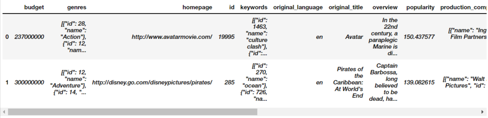

# Movie Recommendation system
A Web Base user-item Movie Recommendation Engine using Collaborative Filtering By matrix factorizations algorithm and The recommendation based on the underlying idea that is if two persons both liked certian common movies,then the movies that one person has liked that the other person has not yet watched can be recommended to him.

Home Page

Recommendation Page

### Why Recommendation Systems?
* They help the user find items of their interest
* Helps the item provider to deliver their items to the right user
* To identify the most relevant products for each user
* Showcase personalised content to each user
* Suggest top offers and discounts to the right user
* Websites can improve user-engagement
* It increases revenues for business through increased consumption

### Data Overview
Source: [TMDB](https://www.themoviedb.org/)

Data: This data contains movies list of 5000 movies from ['The Movie Database (TMDB)'](https://www.themoviedb.org/), as well as various other information ranging from cast, release date, star cast, crew to budget of movie and even the languages in which it was released.

Thier were two data sets which were combined and used as a one

Downloaded the csv file from Kaggle.

### Data Attributes

There are many columns. Only important ones will be discussed here.

1. **Title:** Text column containing the name of the movies. There's anather column containing the name of movies in other languages.

2. **Genres:** JSON format, list containing movies respective generes profile with its id.

3. **Movie ID:** Numbers which represented the unique IDs of movies with which we can search for movies on TMDB.

4. **Keywords:** String containg the small tags which can represent a movie.

5. **Overview:** Text which basically described the plot of the movie.

6. **Cast:** JSON format, Contained the name of the each and every cast from the movie.

7. **Crew:** JSON format, Contained the names, job and designation of each and every crew member.

### Data Snapshot

Let’s look at the data. Movies Dataset:

**Credits Dataset:**

**After merging our dataset looked like this:**

### Count Vectorizer
Machine learning models don’t understand human words, but they know vectors!

We'll be count-vectorizing the combined column to covert the textual data to numeric data so that we can process it further.

### Model Deployment
Deployed the model on local server with the help of Streamlit Library. I must say, it was very efficient to use. Then for finally publishing it online, I took the help of Streamlit.